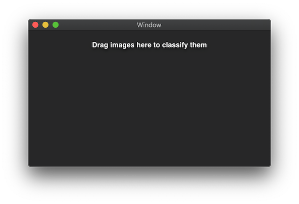
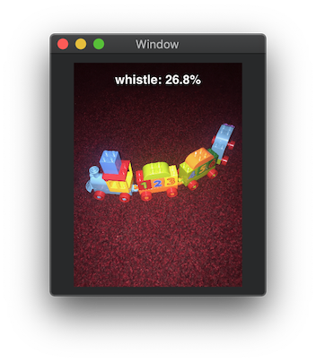

# Image-Recognition-Experiment
Stand-alone experiment to test Swift's built-in machine learning capabilities on the desktop.

## Raison D'être
The examples provided by Apple and third parties for using the image classification capabilities of CoreML tend to focus upon iOS platforms and on building and training a model.  This repository contains a the source code for a stand-alone macOS application onto which a user can drag and drop an image file and have a pre-trained image classifier produce its best guess at what the main object in the scene is.

## Requirements
The model was developed using Xcode 10 and Swift 4 on a 2015 MacBook Pro.

The pre-trained classifier models are not included in the repository as
* They can be big.
* They may be subject to license restrictions.
The good news is that they can be downloaded from [Apple](https://developer.apple.com/machine-learning/models/) or [third parties](https://github.com/likedan/Awesome-CoreML-Models).  The code as supplied here assumes that you have access to the Inceptionv3 model from the latter.  To use it, just download it from [here](https://github.com/yulingtianxia/Core-ML-Sample/blob/master/CoreMLSample/Inceptionv3.mlmodel) and add it to your Xcode project.

If you use a different model from the four common ones listed modify the [`init`](ImageRecognitionExperiment/ImageClassifier.swift#L18-L40) method of `ImageClassifier.swift` to reference the appropriate model.

## Running
The model should run directly from Xcode.  You will be presented with a window like the one below:



Simply drag and drop any image file (with file name extension '.jpg', '.jpeg', '.bmp', '.png', or '.gif') onto the application window and it will make an attempt to identify the main object in the picture.  It is not always successful.




The key lines with regards to classification are found in [`ImageClassifier.swift`](ImageRecognitionExperiment/ImageClassifier.swift#L42-L56).  The following must be wrapped in a `do`... `catch` statement to pick up problems when performing the request.

```
let request = VNCoreMLRequest(model: classifier, completionHandler: self.handleResults)
let handler = VNImageRequestHandler(url: url)
try handler.perform([request])
```

The classifier uses the [Vision](https://developer.apple.com/documentation/vision) framework handle the pre-processing of the images prior to invoking the classifier.  The alternative would be to write a series of functions to resize the image to match the input layer of the model.  The Vision framework contains a number of built-in models to perform tasks such as face, text and barcode recognition but can also be configured, as here, to use a custom pre-trained CoreML model.

Once the model is initialised the request is set up.  This tells the Vision framework what model to use and what to do once the classification has finished.  The reason for this approach is that the classification process can take time so the framework passes it off onto a separate thread.

The image is passed in using the path to its file (as a URL) on the next line.  A `VNImageRequestHandler` applies the specified model to a single image.

The final step is to actually apply the model to the image.

The [`handleResults()`](ImageRecognitionExperiment/ImageClassifier.swift#L58-L66) function simply obtains the classification results from the classifier in descending order of confidence and selects the most likely classification.

## Other Features

This repository also conatins examples of how to implement:

* Transparency and blurring of an entire window (in the [`addVibrancy()`](ImageRecognitionExperiment/ViewController.swift#L29-L46) method of `ViewController.swift`.
* Drag and drop of images onto a custom view in `RecogniserView.swift`.
* Drawing images and text into windows as Core Animation Layers, also in [`RecogniserView.swift`](ImageRecognitionExperiment/RecogniserView.swift#L28-L56).
